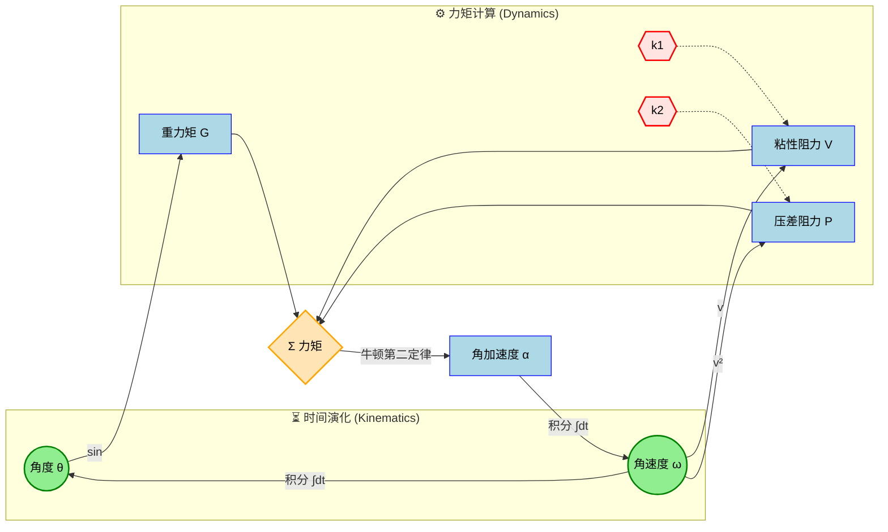
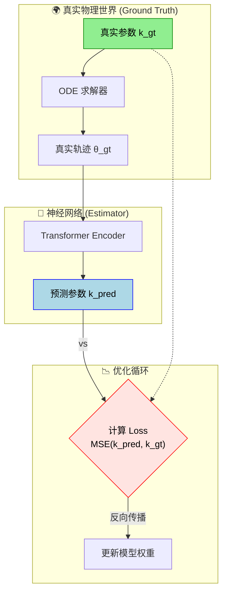
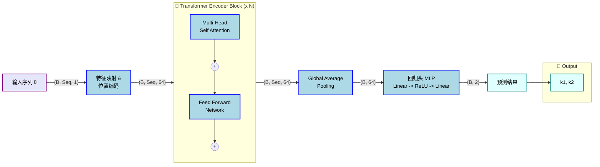

# 🕰️ Transformer Pendulum Estimator (TPE)


> **基于 Transformer 的物理参数反演系统**
>
> 通过深度学习模型，仅凭单摆的**运动轨迹**（角度-时间序列），反向推算出环境中的**空气阻力系数**。

---

## 📚 物理模型原理 (Physics & Dynamics)

### 1. 动力学方程
单摆在混合流体阻力环境下的运动遵循非线性微分方程：

$$ \frac{d\omega}{dt} = \underbrace{-\frac{g}{L}\sin(\theta)}_{\text{重力矩}} - \underbrace{\frac{1}{m}(k_1 \omega + k_2 \omega |\omega|)}_{\text{混合阻力矩}} $$

| 参数 | 物理名称 | 阻力公式 | 物理机制解释 |
| :---: | :--- | :--- | :--- |
| **$k_1$** | **线性阻力** (Viscous) | $F \propto -v$ | **斯托克斯 (Stokes) 阻力**。源于流体粘滞性，主导低速层流。 |
| **$k_2$** | **平方阻力** (Pressure) | $F \propto -v^2$ | **牛顿 (Newton) 阻力**。源于流体压差，主导高速湍流。 |

### 2. 动力学反馈循环 (System Loop)
下图展示了物理参数 ($k_1, k_2$) 如何介入系统，通过力矩影响状态演化：



---

## 📉 反演逻辑 (Inversion Logic)

本项目是一个典型的**反问题 (Inverse Problem)** 求解过程。我们将深度学习模型嵌入到物理观测回路中：



---

## 🧠 模型架构 (Model Architecture)

我们使用 Transformer Encoder 捕捉时间序列中的长期依赖特征。下图展示了数据在网络中的**维度流向 (Tensor Flow)**：



---

## 🚀 快速开始 (Quick Start)

### 1. 环境安装
```bash
conda create -n pendulum python=3.9
conda activate pendulum
pip install -r requirements.txt
```

### 2. 数据生成
求解 ODE 生成模拟数据集。
```bash
python data/generator.py
# 输出: datasets/pendulum_mixed/train.pt
```

### 3. 模型训练
```bash
python train.py --cfg config/params.yaml
```
*训练日志和权重将自动保存至 `runs/train/expN/`。*

### 4. 推理预测
加载最佳权重进行测试。
```bash
python predict.py
```

---

## 📂 目录结构

```text
Pendulum_Transformer/
├── ⚙️ config/
│   └── params.yaml        # 物理常数 (g, L) 及 训练超参
├── 🏭 data/
│   ├── generator.py       # ODE 求解器 (Runge-Kutta)
│   └── dataset.py         # PyTorch Dataset
├── 🧠 models/
│   └── transformer.py     # 核心网络结构
├── 💾 runs/                 # 实验日志
├── 🚀 train.py            # 训练脚本
└── 🎯 predict.py          # 推理脚本
```

## ⚙️ 参数配置

修改 `config/params.yaml`：

```yaml
physics:
  g: 9.81
  L: 1.0
  t_max: 20.0     # 模拟时长

model:
  model_dim: 64   # 嵌入维度
  num_heads: 4    # 注意力头数
  num_layers: 2   # Encoder 层数

train:
  epochs: 50
  batch_size: 64
```

## 📈 性能指标

在参数范围 $k \in [0, 0.5]$ 的测试集上：

| 指标 | 目标值 | 说明 |
| :--- | :--- | :--- |
| **R² Score** | `> 0.98` | 拟合优度，越接近 1 越好 |
| **MSE** | `< 1e-4` | 均方误差，越低越好 |